# cdp-team2

2022-Capability Dev Program - Team2

## Checklist
- [x] Completed Writing Microservice Assigned for each MS
- [x] Written Test Cases (min cov - 80%)
- [x] Dockerizing each microservice
- [x] Swagger Documentation for each microservice endpoints
- [x] Effective Use of GRPC
- [x] Container Orchestration using minikube clustor
- [x] Maintained Source Code
- [x] Created CI/CD pipeline using Jenkins
- [x] Data base model properly show cased

## Technologies

## Logical Overview of Microservices

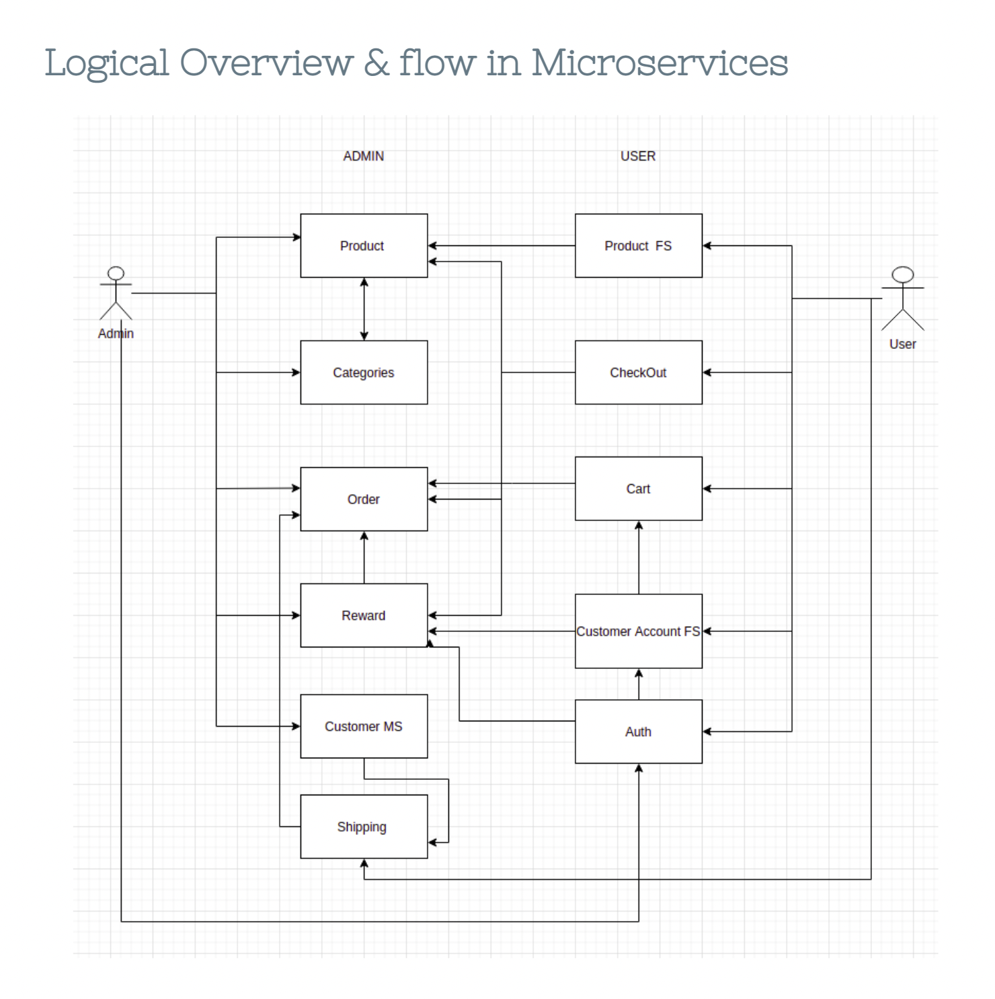

## Devops Flow

## Jenkins

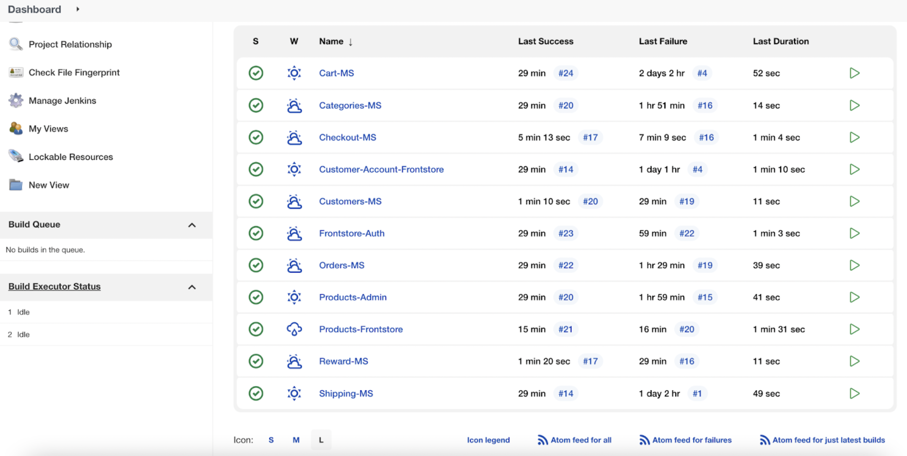

## Kubernetes Services

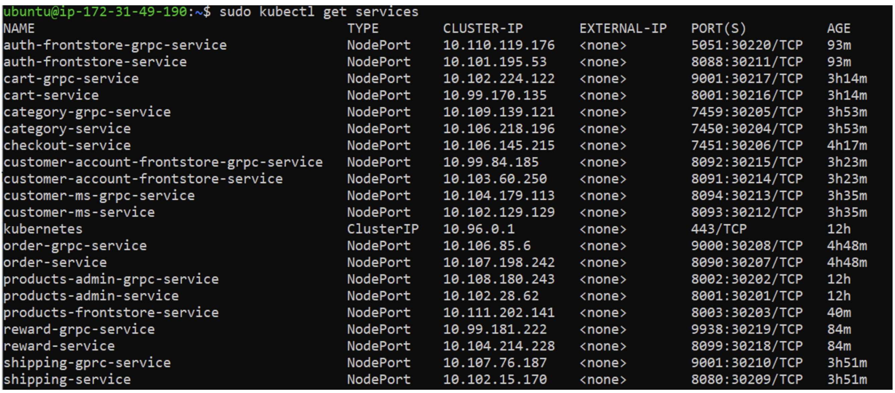

## Auth Microservice

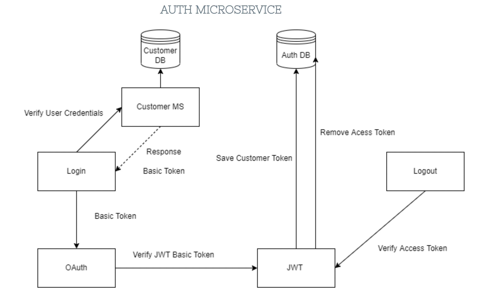

## Customer Account

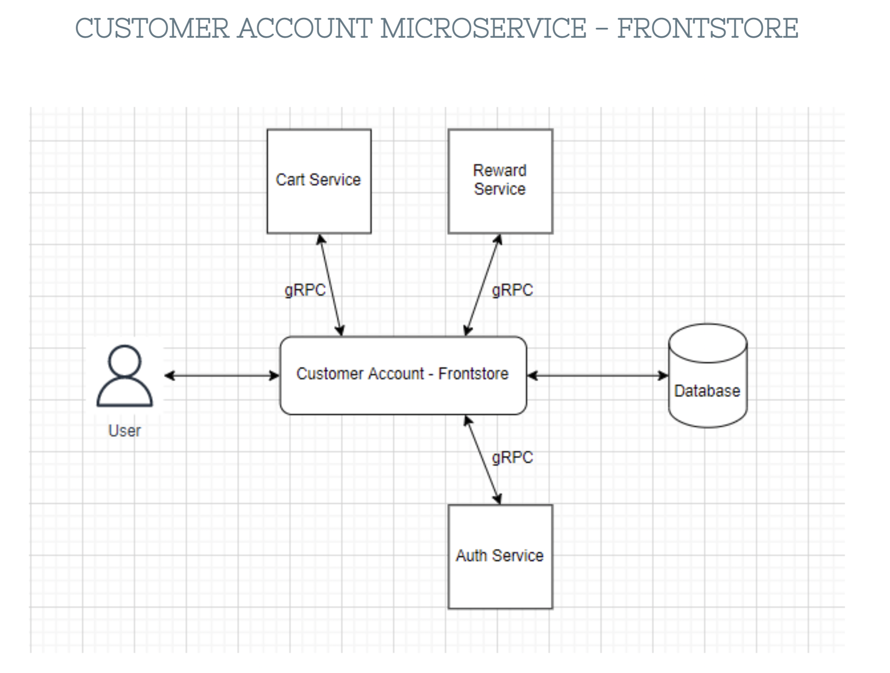

## Customer Admin

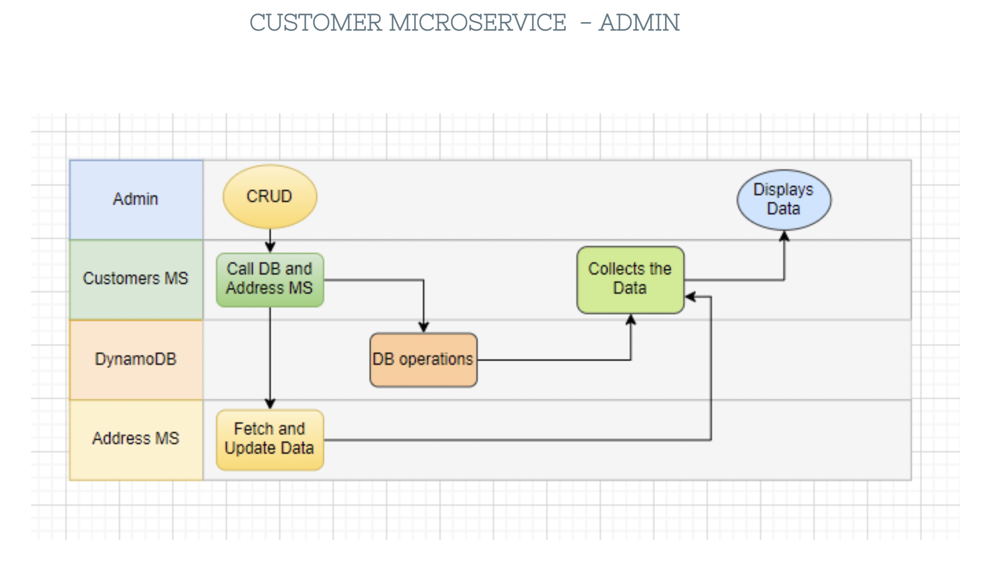

## Products Microservice

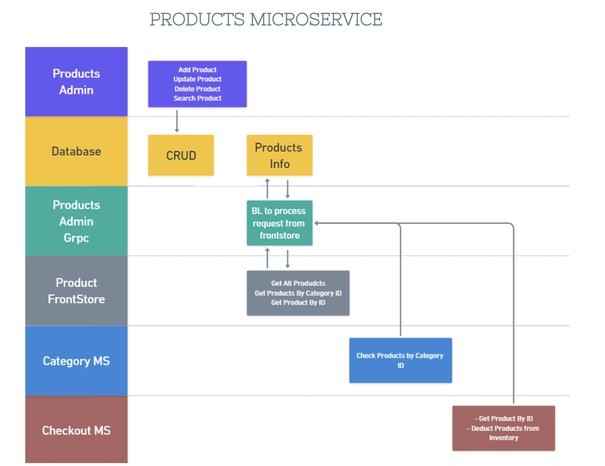

## Cart Microservice

## Categories Microservice

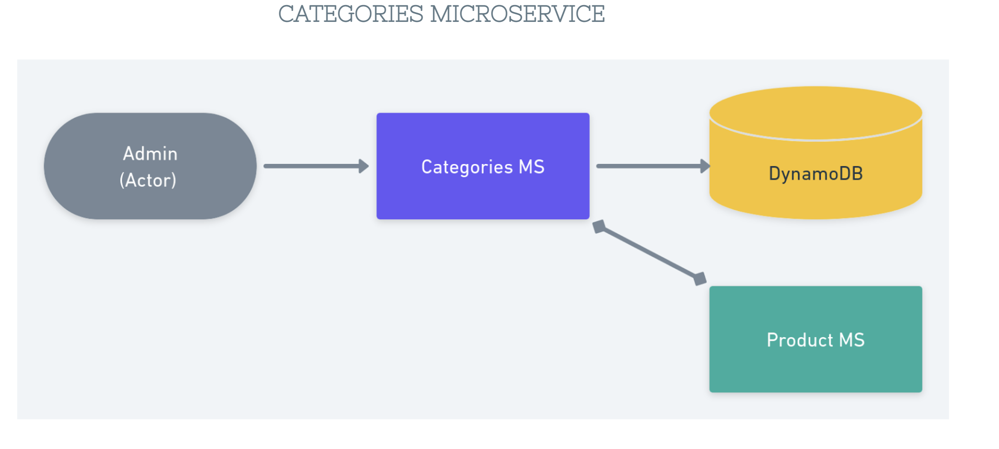

## Checkout Microservice

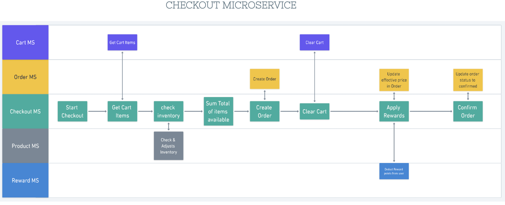

## Reward Microservice

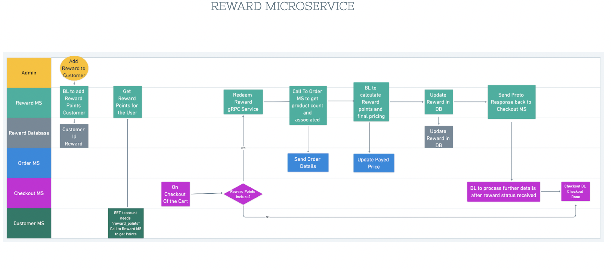

## Order Microservice

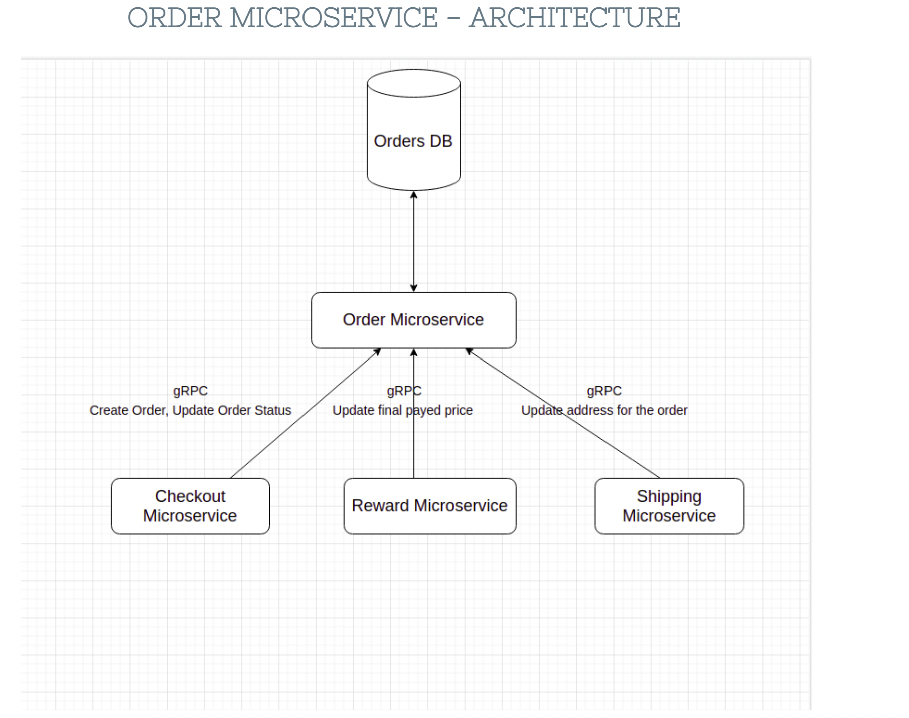

## Shipping Microservice

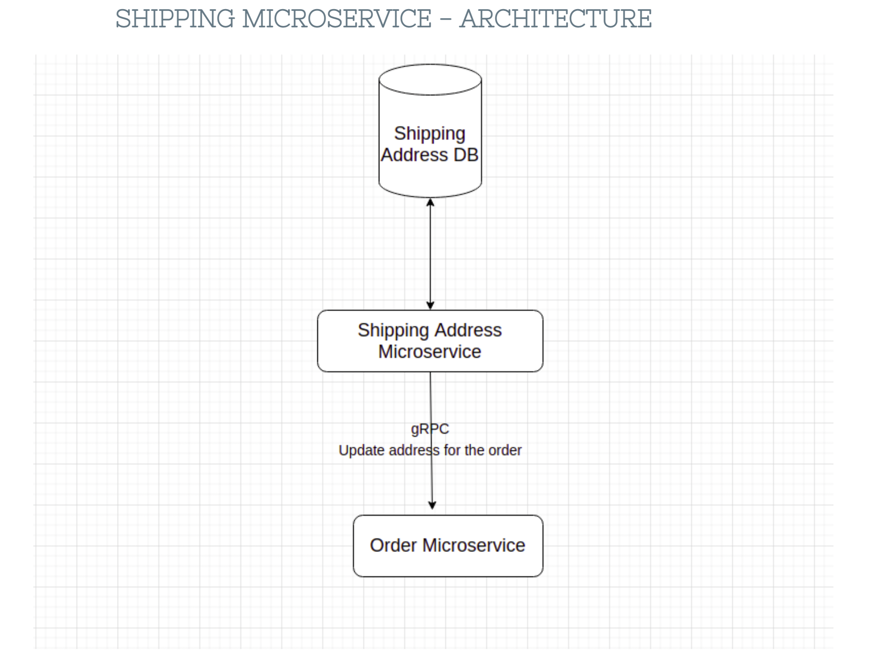
