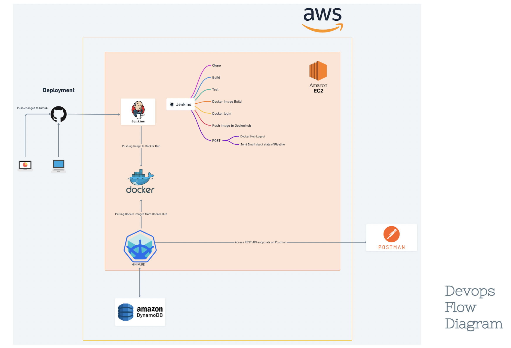
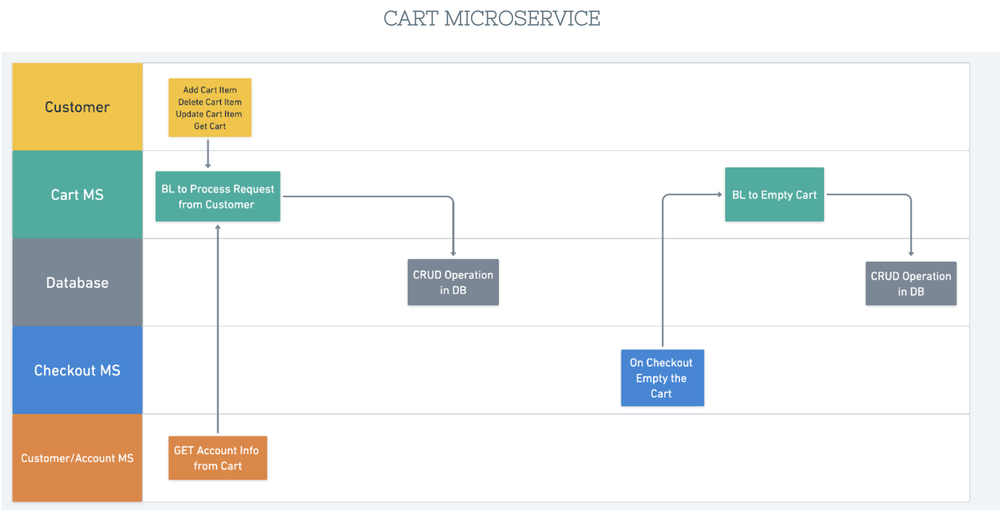

# cdp-team2

2022-Capability Dev Program - Team2

## Checklist
- [x] Completed Writing Microservice Assigned for each MS
- [x] Written Test Cases (min cov - 80%)
- [x] Dockerizing each microservice
- [x] Swagger Documentation for each microservice endpoints
- [x] Effective Use of GRPC
- [x] Container Orchestration using minikube clustor
- [x] Maintained Source Code
- [x] Created CI/CD pipeline using Jenkins
- [x] Data base model properly show cased

## Technologies

## Logical Overview of Microservices

## Devops Flow

## Jenkins

## Kubernetes Services

## Auth Microservice

## Customer Account

## Customer Admin

## Products Microservice

## Cart Microservice

## Categories Microservice

## Checkout Microservice

## Reward Microservice

## Order Microservice

## Shipping Microservice

